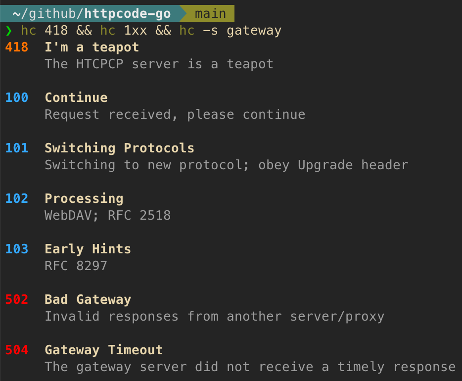

<h1 align="center">hc</h1>
<p align="center">Look up HTTP status codes from the terminal</p>

<p align="center">
  
</p>

<p align="center">
  <a href="#installation">Installation</a> &middot;
  <a href="#usage">Usage</a> &middot;
  <a href="#all-features">Features</a> &middot;
  <a href="LICENSE">License</a>
</p>

---

A fast, zero-config CLI that explains HTTP status codes. Color-coded by class, searchable by text, and supports regex patterns. Single binary, no runtime dependencies.

Go port of [httpcode](https://github.com/rspivak/httpcode).

## Installation

### Go

```bash
go install github.com/rspivak/httpcode-go/cmd/hc@latest
```

## Usage

```
$ hc 404
404  Not Found
     Nothing matches the given URI
```

```
$ hc 418
418  I'm a teapot
     The HTCPCP server is a teapot
```

### Search by description

```
$ hc -s timeout
408  Request Timeout
     Request timed out; try again later

419  Authentication Timeout
     Previously valid authentication has expired

440  Login Timeout
     Microsoft

504  Gateway Timeout
     The gateway server did not receive a timely response

598  Network read timeout error
     Unknown

599  Network connect timeout error
     Unknown
```

### Regex patterns

```
$ hc '30[12]'
301  Moved Permanently
     Object moved permanently -- see URI list

302  Found
     Object moved temporarily -- see URI list
```

### Digit wildcards

Use `x` in place of any digit:

```
$ hc 2xx
200  OK
     Request fulfilled, document follows

201  Created
     Document created, URL follows

202  Accepted
     Request accepted, processing continues off-line
...
```

### List everything

```
$ hc
```

## All features

| Feature | Example |
|---|---|
| Exact lookup | `hc 404` |
| Digit wildcard | `hc 5xx` |
| Regex filter | `hc '4[01][0-9]'` |
| Text search | `hc -s gateway` |
| List all codes | `hc` |

- **Color-coded** -- 1xx blue, 2xx green, 3xx yellow, 4xx orange, 5xx red
- **Adaptive colors** -- looks great on both dark and light terminal themes
- **Pipe-safe** -- colors are automatically stripped when piping to another command
- **77 status codes** -- standard, WebDAV, Nginx, and vendor-specific codes

## License

[MIT](LICENSE)
